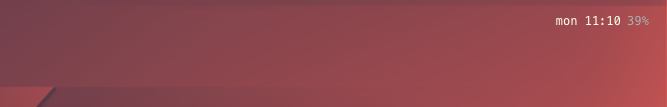

# ezbar

<p align="center">
  
</p>

A widget that displays day + time + battery.

## Installation

Install [Übersicht](http://tracesof.net/uebersicht/). 

Then paste in your choice of terminal:
```
git clone https://github.com/woat/ezbar $HOME/Library/Application\ Support/Übersicht/widgets/ezbar
```
## FAQ

#### How do I remove the background?
Just delete bg.coffee.

#### How come it's underneath my menu bar?
 > System Preferences > General > *tick* Automatically hide and show menu bar.
