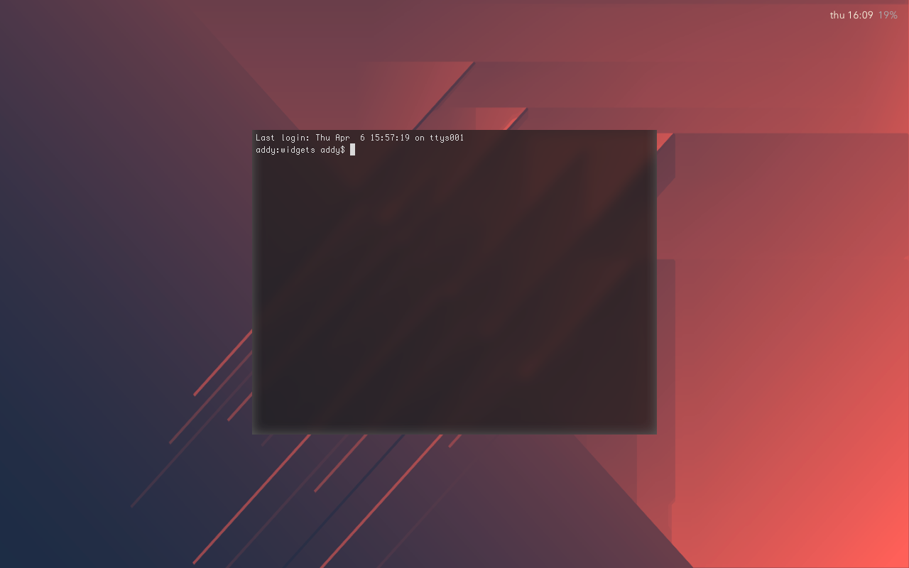

# ezbar




A very simple widget that shows day + time + battery.

## Installation

Install [Übersicht](http://tracesof.net/uebersicht/). 

```bash
git clone https://github.com/woat/ezbar $HOME/Library/Application\ Support/Übersicht/widgets/ezbar
```
